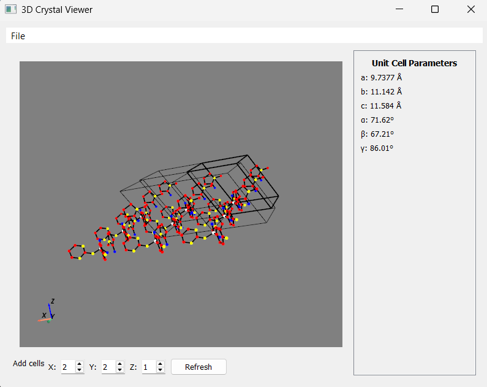

# CIF Visualizer

A basic Crystallographic Information Format File Visualizer to visualize the crystal structures of molecules/compounds in 3D space. Version 1.0.0

## Prerequisites
 - PyQt5.Widgets
 - PyQt5.Core
 - numpy
 - pyvista
 - pyvistaqt
 - System requirement: Windows

## Repository Information
CIF Visualizer is hosted on GitHub. You can find the source code here: [https://github.com/tadoodles/CIF_visualizer]. Contributions are welcome! Feel free to fork, open issues, or create pull requests.

## Getting Started
 - Download the source code here: [https://github.com/tadoodles/CIF_visualizer]
 - Install the required modules

## How to Use
1. Launch the application with `python -m src.main`
2. Open a CIF file using the File menu or press Ctrl+O
3. Use the mouse to rotate the 3D model
4. Adjust the number of unit cells in 3D using the 'XYZ' supercell controls then press Refresh (max of 3 repetitions per axis).
5. Repo includes sample CIF files (1505911.cif exemplifies issue with atomic position)

## Encountering Issues with Installing Required Modules?

### Option 1: For most users (Easy)
1. Download and install [Anaconda](https://www.anaconda.com/products/individual) or [Miniconda](https://docs.conda.io/en/latest/miniconda.html)
2. Download this repository
3. Open Anaconda Navigator
4. Launch a terminal/command prompt
5. Navigate to the downloaded project folder
6. Run: `conda env create -f environment.yml`
7. Run: `conda activate cif_viz`
8. Run: `python -m src.main`

### Option 2: If you encounter any errors during installation
1. Open a terminal/command prompt
2. Run: `conda config --set ssl_verify false`
3. Then continue with steps 6-8 from Option 1

## Known issues & Future Development:
 - Incomplete element radii data
 - Max of 3 repetitions due to optimization constraints
 - H atoms and bonds not displayed
 - Incomplete IT numbers of space groups
 - Bonding is only for covalent bonds
 - Issue with certain molecules (i.e., graphite)
 - Issue with CIF containing data for two or more possible atomic positions of one atom